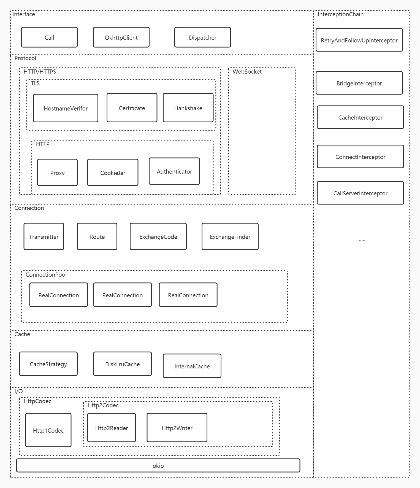
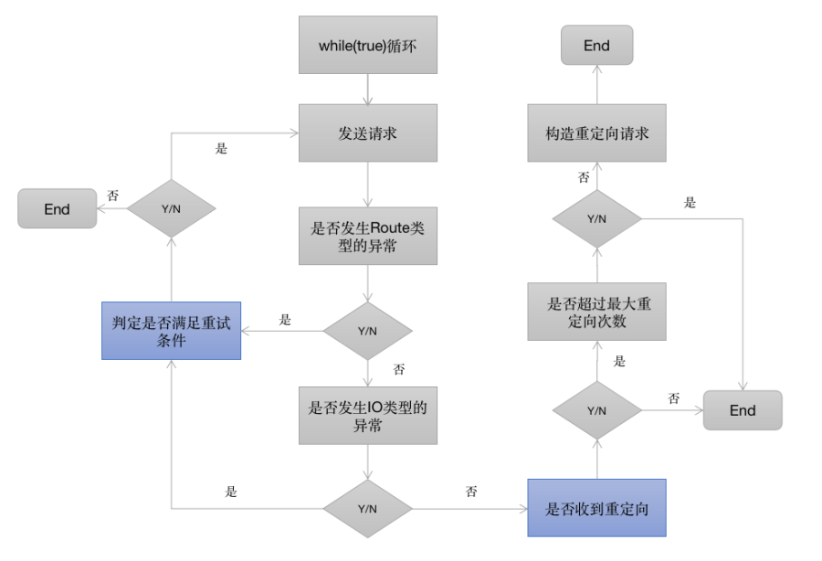
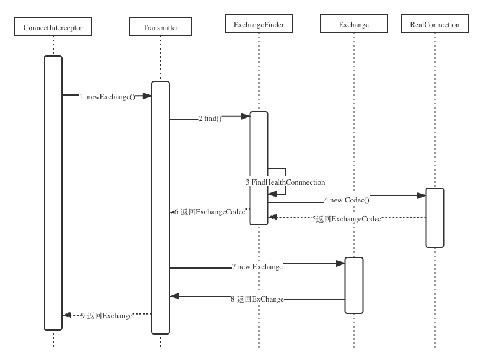
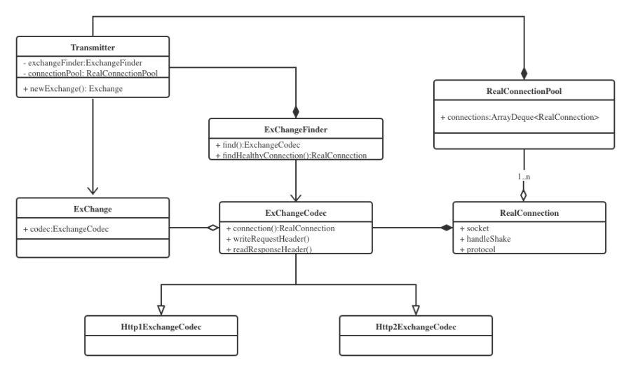
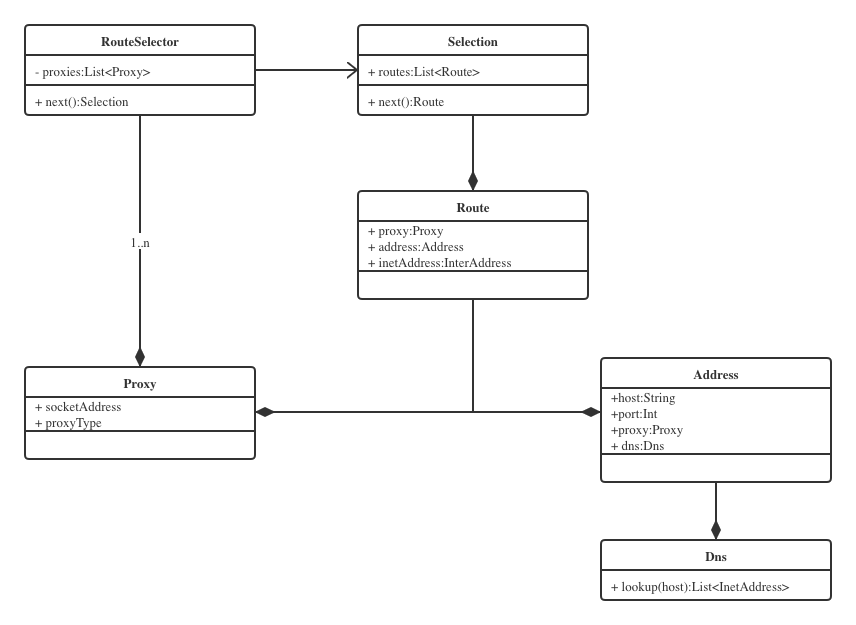

# okhttp
## OkHttp is an HTTP client that’s efficient by default:
* HTTP/2 support allows all requests to the same host to share a socket.
* Connection pooling reduces request latency (if HTTP/2 isn’t available).
* Transparent GZIP shrinks download sizes.
* Response caching avoids the network completely for repeat requests.

## Call
### Follow-up Requests
When your requested URL has moved, the webserver will return a response code like 302 to indicate the document’s new URL. OkHttp will follow the redirect to retrieve a final response.

If the response issues an authorization challenge, OkHttp will ask the Authenticator (if one is configured) to satisfy the challenge. If the authenticator supplies a credential, the request is retried with that credential included.

## Event
Events allow you to capture metrics on your application’s HTTP calls. Use events to monitor:

The size and frequency of the HTTP calls your application makes. If you’re making too many calls, or your calls are too large, you should know about it!
The performance of these calls on the underlying network. If the network’s performance isn’t sufficient, you need to either improve the network or use less of it.
### EventListener
流程监听
```
class PrintingEventListener extends EventListener
```
### Events with Failures

### Events with Retries and Follow-Ups


## 整体结构


OKHttpClient，Request和Response，


RealCal,负责请求的调度（同步的话走当前线程发送请求，异步的话则使用OKHttp内部的线程池进行）；同时负责构造内部逻辑责任链，并执行责任链相关的逻辑，直到获取结果。虽然OKHttpClient是整个OKHttp的核心管理类，但是真正发出请求并且组织逻辑的是RealCall类，它同时肩负了调度和责任链组织的两大重任，接下来我们来着重分析下RealCall类的逻辑。
## 调度器Dispatcher
记录同步任务、异步任务及等待执行的异步任务。
线程池管理异步任务。
发起/取消网络请求API：execute、enqueue、cancel。

OkHttp设置了默认的最大并发请求量 maxRequests = 64 和单个host支持的最大并发量 maxRequestsPerHost = 5。
同时用三个双端队列存储这些请求：

	//异步任务等待队列
	private val readyAsyncCalls = ArrayDeque<AsyncCall>()
	//异步任务队列
	private val runningAsyncCalls = ArrayDeque<AsyncCall>()
	//同步任务队列
	private val runningSyncCalls = ArrayDeque<RealCall>()

	
	private fun promoteAndExecute(): Boolean {
	    val executableCalls = mutableListOf<AsyncCall>()
	    val isRunning: Boolean
	    synchronized(this) {
	      val i = readyAsyncCalls.iterator()
	      //遍历readyAsyncCalls
	      while (i.hasNext()) {
	        val asyncCall = i.next()
	        //阈值校验
	        if (runningAsyncCalls.size >= this.maxRequests) break // Max capacity.
	        if (asyncCall.callsPerHost().get() >= this.maxRequestsPerHost) continue // Host max capacity.
	        //符合条件 从readyAsyncCalls列表中删除
	        i.remove()
	        //per host 计数加1
	        asyncCall.callsPerHost().incrementAndGet()
	        executableCalls.add(asyncCall)
	        //移入runningAsyncCalls列表
	        runningAsyncCalls.add(asyncCall)
	      }
	      isRunning = runningCallsCount() > 0
	    }
	    
	    for (i in 0 until executableCalls.size) {
	      val asyncCall = executableCalls[i]
	      //提交任务到线程池
	      asyncCall.executeOn(executorService)
	    }
	    
	    return isRunning
	}

	//异步任务执行结束
	internal fun finished(call: AsyncCall) {
	    call.callsPerHost().decrementAndGet()
	    finished(runningAsyncCalls, call)
	}
	
	//同步任务执行结束
	internal fun finished(call: RealCall) {
	    finished(runningSyncCalls, call)
	}
	
	//同步异步任务 统一汇总到这里
	private fun <T> finished(calls: Deque<T>, call: T) {
	    val idleCallback: Runnable?
	    synchronized(this) {
	      //将完成的任务从队列中删除
	      if (!calls.remove(call)) throw AssertionError("Call wasn't in-flight!")
	      idleCallback = this.idleCallback
	    }
	    //这个方法在第一步中已经分析，用于将等待队列中的请求移入异步队列，并交由线程池执行。
	    val isRunning = promoteAndExecute()
	    
	    //如果没有请求需要执行，回调闲置callback
	    if (!isRunning && idleCallback != null) {
	      idleCallback.run()
	    }
	}

线程池


	@get:JvmName("executorService") val executorService: ExecutorService
	get() {
	  if (executorServiceOrNull == null) {
	    executorServiceOrNull = ThreadPoolExecutor(0, Int.MAX_VALUE, 60, TimeUnit.SECONDS,
	        SynchronousQueue(), threadFactory("OkHttp Dispatcher", false))
	  }
	  return executorServiceOrNull!!
	}

阻塞队列用的SynchronousQueue，它的特点是不存储数据，当添加一个元素时，必须等待一个消费线程取出它，否则一直阻塞，如果当前有空闲线程则直接在这个空闲线程执行，如果没有则新启动一个线程执行任务。通常用于需要快速响应任务的场景，在网络请求要求低延迟的大背景下比较合适


## 责任链模式，或是拦截链模式


	fun getResponseWithInterceptorChain(): Response {
	    //创建拦截器数组
	    val interceptors = mutableListOf<Interceptor>()
	    //添加应用拦截器
	    interceptors += client.interceptors
	    //添加重试和重定向拦截器
	    interceptors += RetryAndFollowUpInterceptor(client)
	    //添加桥接拦截器
	    interceptors += BridgeInterceptor(client.cookieJar)
	    //添加缓存拦截器
	    interceptors += CacheInterceptor(client.cache)
	    //添加连接拦截器
	    interceptors += ConnectInterceptor
	    if (!forWebSocket) {
	      //添加网络拦截器
	      interceptors += client.networkInterceptors
	    }
	    //添加请求拦截器
	    interceptors += CallServerInterceptor(forWebSocket)
	    
	    //创建责任链
	    val chain = RealInterceptorChain(interceptors, transmitter, null, 0, originalRequest, this,
	        client.connectTimeoutMillis, client.readTimeoutMillis, client.writeTimeoutMillis)
	    ...
	    try {
	      //启动责任链
	      val response = chain.proceed(originalRequest)
	      ...
	      return response
	    } catch (e: IOException) {
	      ...
	    }
	  }

### 拦截链demo已经抽出来
* 拦截器按照添加顺序依次执行
* 拦截器的执行从RealInterceptorChain.proceed()开始，进入到第一个拦截器的执行逻辑
* 每个拦截器在执行之前，会将剩余尚未执行的拦截器组成新的RealInterceptorChain,
* 拦截器的逻辑被新的责任链调用next.proceed()切分为start， next.proceed, end这三个部分依次执行
* next.proceed()所代表的其实就是剩余所有拦截器的执行逻辑
* 所有拦截器最终形成一个层层内嵌的嵌套结构

总共添加了五个拦截器（不包含自定义的拦截器如client.interceptors和client.networkInterceptors）

interceptors和NetworkInterceptors的区别
前面提到，在OKHttpClient.Builder的构造方法有两个参数，使用者可以通过addInterceptor和addNetworkdInterceptor添加自定义的拦截器，分析完RetryAndFollowUpInterceptor我们就可以知道这两种自动拦截器的区别了。


从前面添加拦截器的顺序可以知道Interceptors和networkInterceptors刚好一个在RetryAndFollowUpInterceptor的前面，一个在后面。


结合前面的责任链调用图可以分析出来，假如一个请求在RetryAndFollowUpInterceptor这个拦截器内部重试或者重定向了N次，那么其内部嵌套的所有拦截器也会被调用N次，同样networkInterceptors自定义的拦截器也会被调用N次。而相对的Interceptors则一个请求只会调用一次，所以在OKHttp的内部也将其称之为Application Interceptor。
先来大概的了解下每一个拦截器的作用

* retryAndFollowUpInterceptor——失败和重定向拦截器
* BridgeInterceptor——封装request和response拦截器
* CacheInterceptor——缓存相关的过滤器，负责读取缓存直接返回、更新缓存
* ConnectInterceptor——连接服务，负责和服务器建立连接 这里才是真正的请求网络
* CallServerInterceptor——执行流操作(写出请求体、获得响应数据) 负责向服务器发送请求数据、从服务器读取响应数据 进行http请求报文的封装与请求报文的解析

### RetryAndFollowUpInterceptor



1，当请求内部抛出异常时，判定是否需要重试
2，当响应结果是3xx重定向时，构建新的请求并发送请求


重试的逻辑相对复杂，有如下的判定逻辑（具体代码在RetryAndFollowUpInterceptor类的recover方法）：
* 规则1: client的retryOnConnectionFailure参数设置为false，不进行重试
* 规则2: 请求的body已经发出，不进行重试
* 规则3: 特殊的异常类型不进行重试（如ProtocolException，SSLHandshakeException等）
* 规则4: 没有更多的route（包含proxy和inetaddress），不进行重试

### BridgeInterceptor和CacheInterceptor
BridageInterceptor拦截器的功能如下：

负责把用户构造的请求转换为发送到服务器的请求 、把服务器返回的响应转换为用户友好的响应，是从应用程序代码到网络代码的桥梁
设置内容长度，内容编码
设置gzip压缩，并在接收到内容后进行解压。省去了应用层处理数据解压的麻烦
添加cookie
设置其他报头，如User-Agent,Host,Keep-alive等。其中Keep-Alive是实现连接复用的必要步骤

CacheInterceptor拦截器的逻辑流程如下：
* 1.通过Request尝试到Cache中拿缓存，当然前提是OkHttpClient中配置了缓存，默认是不支持的。
* 2.根据response,time,request创建一个缓存策略，用于判断怎样使用缓存。
* 3.如果缓存策略中设置禁止使用网络，并且缓存又为空，则构建一个Response直接返回，注意返回码=504
* 4.缓存策略中设置不使用网络，但是又缓存，直接返回缓存
* 5.接着走后续过滤器的流程，chain.proceed(networkRequest)
* 6.当缓存存在的时候，如果网络返回的Resposne为304，则使用缓存的Resposne。
* 7.构建网络请求的Resposne
* 8.当在OKHttpClient中配置了缓存，则将这个Resposne缓存起来。
* 9.缓存起来的步骤也是先缓存header，再缓存body。
* 10.返回Resposne


### ConnectInterceptor
connectInterceptor应该是最重要的拦截器之一了，它同时负责了Dns解析和Socket连接（包括tls连接）。

先来看方法调用的时序图，梳理出关键步骤：


* ConnectInterceptor调用transmitter.newExchange
* Transmitter先调用ExchangeFinder的find()获得ExchangeCodec
* ExchangeFinder调用自身的findHealthConnectio获得RealConnection
* ExchangeFinder通过刚才获取的RealConnection的codec()方法获得ExchangeCodec
* Transmitter获取到了ExchangeCodec，然后new了一个ExChange，将刚才的ExchangeCodec包含在内

最终Connectinterceptor通过Transmitter获取到了一个Exchange的类，这个类有两个实现，一个是Http1ExchangeCodec，一个是Http2Exchangecodec，分别对应的是Http1协议和Http2协议。


前面获得的Exchange类里面包含了ExchangeCodec对象，而这个对象里面又包含了一个RealConnection对象，RealConnection的属性成员有socket,handlShake,protocol等，可见它应该是一个Socket连接的包装类，而ExchangeCode对象是对RealConnection操作（writeRequestHeader,readResposneHeader）的封装。


通过这两个图可以很清晰的知道，最终获得的是一个已经建立连接的Socket对象，也就是说，在ConnectInterceptor内部已经完成了socket连接，那么具体是哪一步完成的呢？


看上面的时序图，可以知道，获得RealConnection的ExchangeFinder调用的findHealthConnection()方法，因此，socket连接的获取和建立都是在这里完成的。


同样，在socket进行连接之前，其实还有一个dns的过程，也是隐含在findHealthConnection 里的内部逻辑，详细的过程在后面DNS的过程再进行分析，这里ConnectionInterceptor的任务已经完成了。


另外还需要注意的一点是，在执行完ConnectInterceptor之后，其实添加了自定义的网络拦截器networkInterceptors，按照顺序执行的规定，所有的networkInterceptor执行执行，socket连接其实已经建立了，可以通过realChain拿到socket做一些事情了，这也就是为什么称之为network Interceptor的原因。
### CallServerInterceptor
CalllServerInterceptor是最后一个拦截器了，前面的拦截器已经完成了socket连接和tls连接，那么这一步就是传输http的头部和body数据了。
CallServerInterceptor由以下步骤组成：

* 向服务器发送 request header；
* 如果有 request body，就向服务器发送；
* 读取 response header，先构造一个 Response 对象；
* 如果有 response body，就在 3 的基础上加上 body 构造一个新的 Response 对象；
## 任务队列
## 连接复用和连接池
Socket连接和Dns过程都是在ConnecInterceptor中通过Transmitter和ExchangeFinder来完成的，而在前面的时序图中可以看到，最终建立Socket连接的方法是通过ExchangeFinder的findConnection来完成的，可以说一切秘密都是findConnection方法中。因此接下来详细解析下findConnection()，这里贴出源码和注释。

	synchronized(connectionPool) {
	      //前面有一大段判定当前的conencection是否需要释放，先删除
	      .....
	
	      if (result == null) {
	        // 1, 第一次尝试从缓冲池里面获取RealConnection(Socket的包装类)
	        if (connectionPool.transmitterAcquirePooledConnection(address, transmitter, null, false)) {
	          foundPooledConnection = true
	          result = transmitter.connection
	        } else if (nextRouteToTry != null) {
	          //2, 如果缓冲池中没有，则看看有没有下一个Route可以尝试，这里只有重试的情况会走进来
	          selectedRoute = nextRouteToTry
	          nextRouteToTry = null
	        } else if (retryCurrentRoute()) {
	          //3,如果已经设置了使用当前Route重试，那么会继续使用当前的Route
	          selectedRoute = transmitter.connection!!.route()
	        }
	      }
	    }
	    if (result != null) {
	      // 4，如果前面发现ConnectionPool或者transmiter中有可以复用的Connection，这里就直接返回了
	      return result!!
	    }
	
	    // 5, 如果前面没有获取到Connection，这里就需要通过routeSelector来获取到新的Route来进行Connection的建立
	    var newRouteSelection = false
	    if (selectedRoute == null && (routeSelection == null || !routeSelection!!.hasNext())) {
	      newRouteSelection = true
	      //6，获取route的过程其实就是DNS获取到域名IP的过程，这是一个阻塞的过程，会等待DNS结果返回
	      routeSelection = routeSelector.next()
	    }
	
	    var routes: List<Route>? = null
	    synchronized(connectionPool) {
	      if (newRouteSelection) {
	        // Now that we have a set of IP addresses, make another attempt at getting a connection from
	        // the pool. This could match due to connection coalescing.
	        routes = routeSelection!!.routes
	        //7，前面如果通过routeSelector拿到新的Route，其实就是相当于拿到一批新的IP，这里会再次尝试从ConnectionPool
	        // 中检查是否有可以复用的Connection
	        if (connectionPool.transmitterAcquirePooledConnection( address, transmitter, routes, false)) {
	          foundPooledConnection = true
	          result = transmitter.connection
	        }
	      }
	 if (!foundPooledConnection) {
	        if (selectedRoute == null) {
	           //8，前面我们拿到的是一批IP，这里通过routeSelection获取到其中一个IP，Route是proxy和InetAddress的包装类
	          selectedRoute = routeSelection!!.next()
	        }
	
	        // Create a connection and assign it to this allocation immediately. This makes it possible
	        // for an asynchronous cancel() to interrupt the handshake we're about to do.
	        //9，用新的route创建RealConnection，注意这里还没有尝试连接
	        result = RealConnection(connectionPool, selectedRoute!!)
	        connectingConnection = result
	      }
	  }
	
	    // If we found a pooled connection on the 2nd time around, we're done.
	    // 10，注释说得很清楚，如果第二次从connectionPool获取到Connection可以直接返回了
	    if (foundPooledConnection) {
	      eventListener.connectionAcquired(call, result!!)
	      return result!!
	    }
	
	    // Do TCP + TLS handshakes. This is a blocking operation.
	    //11，原文注释的很清楚，这里是进行TCP + TLS连接的地方
	    result!!.connect(
	        connectTimeout,   
	 readTimeout,
	        writeTimeout,
	        pingIntervalMillis,
	        connectionRetryEnabled,
	        call,
	        eventListener
	    )
	 //后面一段是将连接成功的RealConnection放到ConnectionPool里面，这里就不贴出来了
	    }
	    return result!!

上面的流程可以看到，findConnection这个方法做了以下几件事：

* 检查当前exchangeFinder所保存的Connection是否满足此次请求
* 检查当前连接池ConnectionPool中是否满足此次请求的Connection
* 检查当前RouteSelector列表中，是否还有可用Route(Route是proxy,IP地址的包装类)，如果没有就发起DNS请求
* 通过DNS获取到新的Route之后，第二次从ConnectionPool查找有无可复用的Connection，否则就创建新的RealConnection
* 用RealConnection进行TCP和TLS连接，连接成功后保存到ConnectionPool

### Connection的连接复用
可以看到，第二步和第四步对ConnectionPool做了两次复用检查，第五步创建了新的RealConnection之后就会写会到ConnectionPool中。
因此这里就是OKHttp的连接复用其实是通过ConnectionPool来实现的，前面的类图中也反映出来，ConnectionPool内部有一个connections的ArrayDeque对象就是用来保存缓存的连接池。


### DNS过程
从前面解析的步骤可知，Dns的过程隐藏在了第三步RouteSelector检查中，整个过程在findConnection方法中写的比较散，可能不是特别好理解，但是只要搞明白了RouteSelector, RouteSelection，Route这三个类的关系，其实就比较容易理解了，如下图中展示了三个类之间的关系。

可以得到如下结论:

RouteSelector在调用next遍历在不同proxy情况下获得下一个Selection封装类,Selection持有一个Route的列表, 也就是每个proxy都对应有Route列表
Selection其实就是针对List<Route>封装的一个迭代器，通过next()方法获得下一个Route，Route持有proxy,address和inetAddress，可以理解为Route就是针对IP和Proxy配对的一个封装
RouteSelector的next()方法内部调用了nextProxy(), nextProxy()又会调用resetNextInetSocketAddres()方法
resetNextInetSocketAddres通过address.dns.lookup获取InetSocketAddress，也就是IP地址

通过上面一系列流程知道，IP地址最终是通过address的dns获取到的，而这个dns又是怎么构建的呢？


反向追踪代码，定位到address的dns是transmitter在构建address的时候，将内置的client.dns传递进来，而client.dns是在okhttpclient的构建过程中传递进来Dns.System，里面的lookup是通过InetAddress.getAllByName 方法获取到对应域名的IP，也就是默认的Dns实现。

### Socket连接的建立：

通过Dns获得Connectoin之后，就是建立连接的过程了，在findConnection中只体现为一句代码

	result!!.connect(
	        connectTimeout,
	        readTimeout,
	        writeTimeout,
	        pingIntervalMillis,
	        connectionRetryEnabled,
	        call,
	        eventListener
	)

这里的result是RealConnection类型的对象，就是调用了RealConnection.connect方法，终于离开findConnection 了，接下来看下connect 方法的源码

	//省略前面一大段 
	....
	
	    while (true) {
	      try {
	        if (route.requiresTunnel()) {
	 //这里进入的条件是，通过http代理了https请求，有一个特殊的协议交换过程
	          connectTunnel(connectTimeout, readTimeout, writeTimeout, call, eventListener)
	        } else {
	 //建立socket连接
	          connectSocket(connectTimeout, readTimeout, call, eventListener)
	        }
	 //如果前面判定是https请求，这里就是https的tls建立过程
	        establishProtocol(connectionSpecSelector, pingIntervalMillis, call, eventListener)
	        break
	      } catch (e: IOException) {
	 //清理资源
	        socket?.closeQuietly()
	 //对异常做二次封装，然后抛出
	        if (routeException == null) {
	          routeException = RouteException(e)
	        } else {
	          routeException.addConnectException(e)
	        }
	        if (!connectionRetryEnabled || !connectionSpecSelector.connectionFailed(e)) {
	          throw routeException
	        }
	      }
	    }