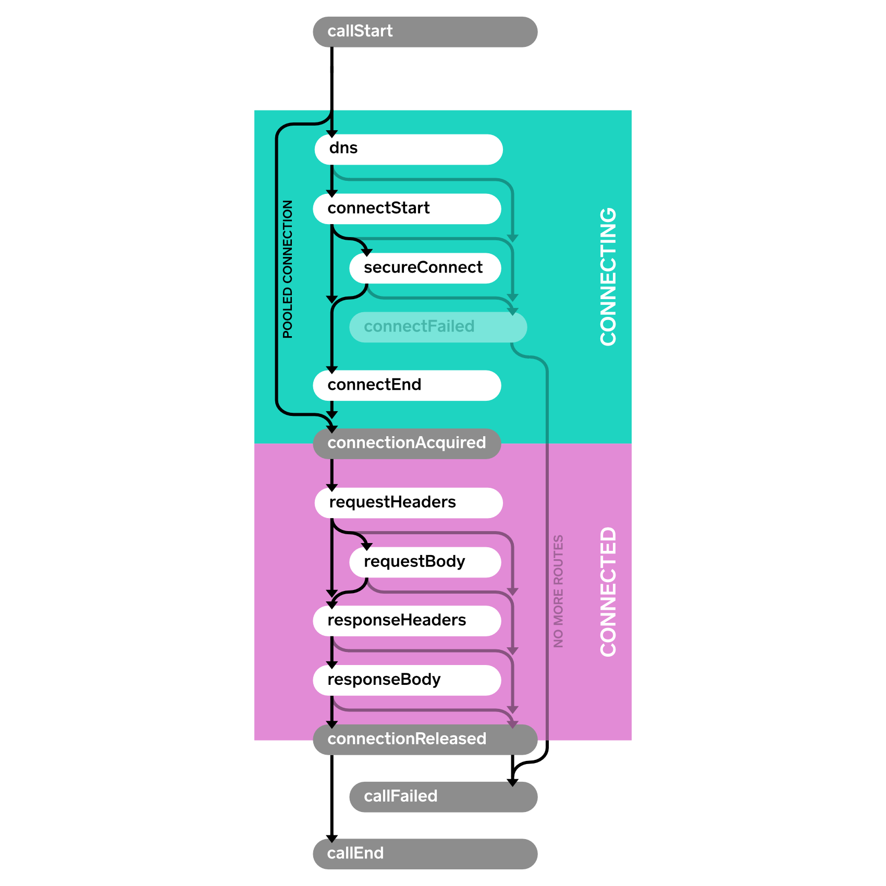

# okhttp
## OkHttp is an HTTP client that’s efficient by default:
* HTTP/2 support allows all requests to the same host to share a socket.
* Connection pooling reduces request latency (if HTTP/2 isn’t available).
* Transparent GZIP shrinks download sizes.
* Response caching avoids the network completely for repeat requests.

## Call
### Follow-up Requests
When your requested URL has moved, the webserver will return a response code like 302 to indicate the document’s new URL. OkHttp will follow the redirect to retrieve a final response.

If the response issues an authorization challenge, OkHttp will ask the Authenticator (if one is configured) to satisfy the challenge. If the authenticator supplies a credential, the request is retried with that credential included.

## Event
Events allow you to capture metrics on your application’s HTTP calls. Use events to monitor:

The size and frequency of the HTTP calls your application makes. If you’re making too many calls, or your calls are too large, you should know about it!
The performance of these calls on the underlying network. If the network’s performance isn’t sufficient, you need to either improve the network or use less of it.
### EventListener
流程监听
```
class PrintingEventListener extends EventListener
```
### Events with Failures

### Events with Retries and Follow-Ups


## Interceptors
拦截器是一个强大的机制可用于监视，重试请求，有两种拦截器，Application Interceptors和Network Interceptors，Application Interceptors只会调用一次，Network Interceptors没有限制
## 类图

## 责任链模式，或是拦截链模式